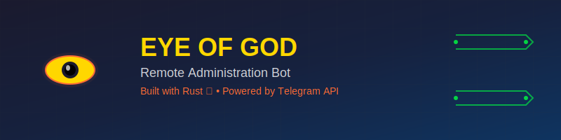

<div align="center">
  
  
  # 👁️ Eye Remote Admin Bot
  
  <p align="center">
    <strong>A powerful Telegram bot for remote system administration built with Rust</strong>
  </p>
  
  <p align="center">
    
    
    
    
  </p>
</div>

---

## 🚀 Features

- **22 Remote Commands**: System monitoring, file operations, process management
- **Secure Authentication**: Argon2 password hashing + chat ID verification
- **Stealth Mode**: Completely invisible operation without console windows
- **Auto-persistence**: Multiple startup mechanisms for continuous operation
- **Cross-platform**: Native Windows support with system API integration

## 📁 Project Structure

```
Eye-Of-God/
├── src/                    # Source code
├── releases/               # Final executable files
│   ├── eye-ultimate-enhanced.exe   # Full-featured version
│   └── eye-ultimate-stealth.exe    # Invisible stealth version
├── scripts/                # Build and utility scripts
├── tools/                  # Development tools and configs
├── docs/                   # Documentation
├── assets/                 # Project assets (logos, etc.)
└── target/                 # Rust build artifacts
```

## 🛠️ Build Instructions

1. Install Rust (https://rustup.rs/)
2. Clone this repository
3. Run `cargo build --release`

### Build Variants

- **Enhanced**: `cargo build --release --bin eye`
- **Stealth**: `cargo build --release --bin eye-stealth`

## 📋 Available Commands

| Command | Description |
|---------|-------------|
| `/info` | System information |
| `/screenshot` | Capture screen |
| `/camera` | Take webcam photo |
| `/processes` | List running processes |
| `/files` | Browse file system |
| `/download` | Download files |
| `/upload` | Upload files |
| `/execute` | Run system commands |
| `/keylogger` | Start keylogger |
| `/location` | Get GPS location |
| `/wifi` | Extract WiFi passwords |
| `/browsers` | Get saved browser passwords |
| `/clipboard` | Get clipboard content |
| `/monitor` | System monitoring |
| `/popup` | Show popup messages |
| `/shutdown` | System shutdown |
| `/restart` | System restart |
| `/lock` | Lock screen |
| `/volume` | Control audio |
| `/start_app` | Launch applications |
| `/kill` | Terminate processes |
| `/selfdestruct` | Self-removal |

## ⚙️ Configuration

1. Create a Telegram bot via @BotFather
2. Configure your bot token and authorized chat ID in the source code
3. Build and deploy

## 🔒 Security Features

- Token obfuscation with decoy tokens
- Argon2 password hashing
- Anti-debugging protection
- Authorized user verification
- Secure communication via Telegram API

## 📝 Technical Details

- **Language**: Rust 2021
- **Runtime**: Tokio async
- **Dependencies**: reqwest, serde, winapi, screenshots, clipboard-win
- **Target**: Windows x64
- **Size**: ~7MB (enhanced), ~6.5MB (stealth)

## 🎯 Use Cases

- **System Administration**: Remote server management
- **IT Support**: Remote troubleshooting and maintenance
- **Personal Use**: Home computer monitoring
- **Security Research**: Educational purposes

## ⚠️ Legal Notice

This software is intended for legitimate system administration purposes only. Users are responsible for complying with all applicable laws and regulations in their jurisdiction. The developers assume no liability for misuse of this software.

## 🛡️ Disclaimer

This project is for educational and legitimate administrative purposes. Ensure you have proper authorization before using this software on any system you do not own.

## 🤝 Contributing

Contributions are welcome! Please feel free to submit a Pull Request.

## 📄 License

This project is licensed under the MIT License - see the [LICENSE](LICENSE) file for details.

---

<div align="center">
  <p><strong>Made with ❤️ and Rust 🦀</strong></p>
  <p><em>For legitimate system administration purposes only</em></p>
</div>

